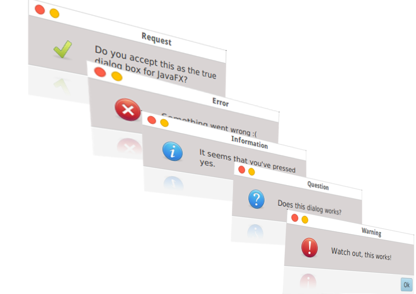

DialogFX Project
================

*****

_NOTE 1_: DialogFX is now incorporated into the JFXtras project. Please visit us there on GitHub for the latest
code and JavaFX goodies!

_NOTE 2_: Dialogs are fully supported by the Java 8u40, so there's no need to use this project.

DialogFX adds fully-baked and flexible dialog box functionality to JavaFX 2.2+!

Dive in the [code](https://github.com/rafaelcn/DialogFX/blob/master/examples/Main.java) to see how _simple_ it is!

__What does it looks like?__

__Contributors__
 
 * Rafael Campos Nunes <rafaelnunes737@hotmail.com> (@rafaellnunees)
 * Mark Heckler <mark.heckler@gmail.com> (@MkHeck)
 * Gerrit Grunwald (also known as HanSolo)
